# DSW1-AA2
Atividade avaliativa 2 referente ao projeto da disciplina Desenvolvimento de Software para Web 1, ministrada pelo professor Alan Demetrius.

# Sistema para Locação de Bicicletas

Este projeto foi desenvolvido como parte da disciplina Desenvolvimento de Software para Web 1, ministrada pelo professor Alan Demetrius. O objetivo principal do projeto é criar uma aplicação web para um Sistema de Locação de Bicicletas. O documento de requisitos está presente no repositório.

## Banco de Dados
Abaixo encontra-se a abordagem do banco de dados adotada para o projeto.
### Modelo Entidade-Relacionamento 
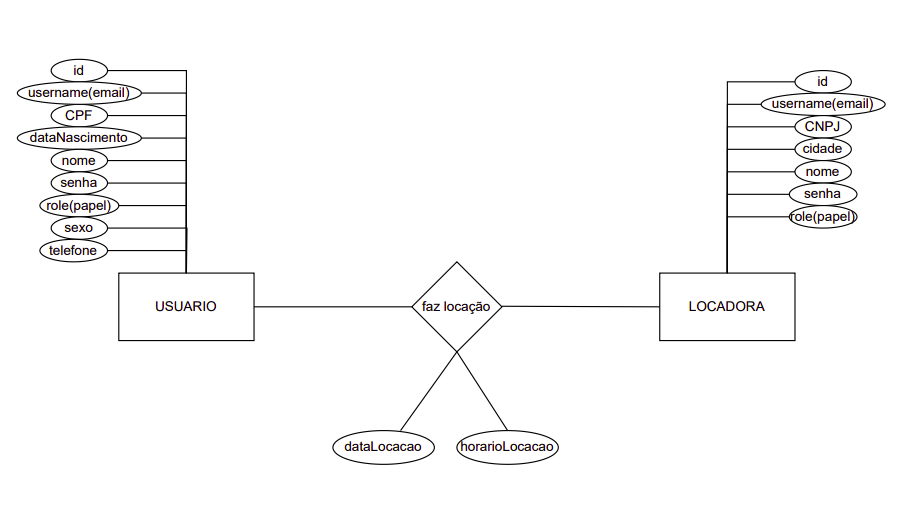
### Tabelas SQL
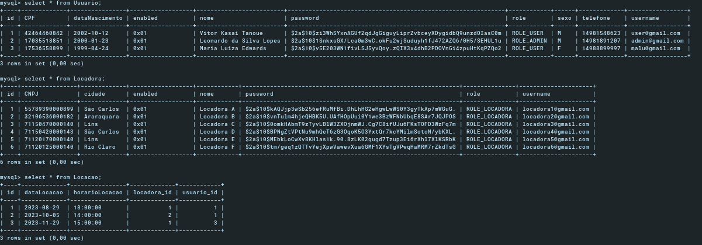
## Resumo do Trabalho
### Tecnologias Utilizadas
O projeto foi criado utilizando as seguintes tecnologias do lado do servidor:
- Spring MVC
- Spring Data JPA
- String Security
- Thymeleaf

No ambiente de desenvolvimento, foram utilizados:
- Maven
- Apache Tomcat

Este trabalho consiste em elaborar uma aplicação web relacionada à um sistema de locação de bicicletas utilizando a framework Spring para Java. Foi seguida a arquitetura de separação em Controladores, DAOs e Domain (classes), seguindo os princípios do MVC (Model-View-Controller). A ideia por trás da metodologia dos trabalhos práticos é partir da abordagem de implementação mais antiga e robusta (Servlets), até as abordagens mais contemporâneas como Spring e Rest API(será realizado futuramente na AA3). 

## Página Inicial (index)
A página inicial da nossa aplicação contém dois links. Um para se autenticar (Login) e outro para visualizar todas as locadoras presentes no sistema.

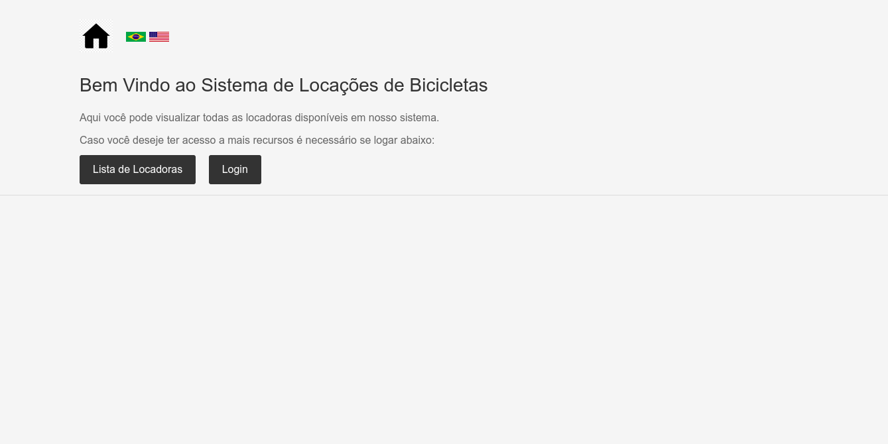

## Página de Login
A página de login possui os campos de email(username requisitado para se autenticar) e a senha.

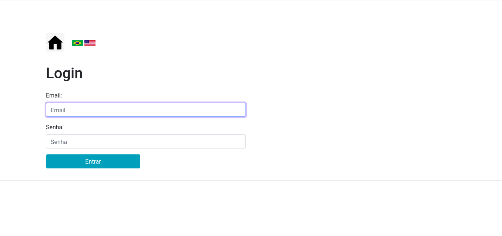

## Página de Visualização de Locadoras
Essa página se refere a visualização de todas as locadoras presentes no sistema. Como se encontra especificado nos requisitos, para acessar a visualização de locadoras não é necessário autenticação.

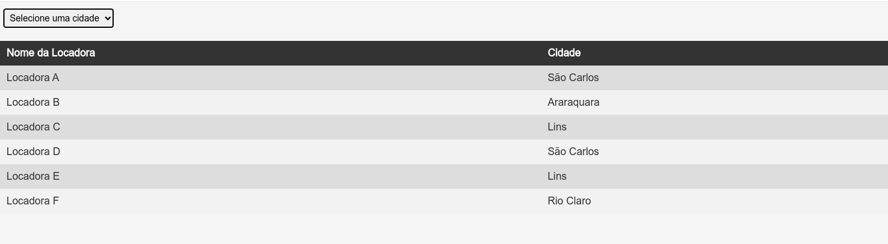
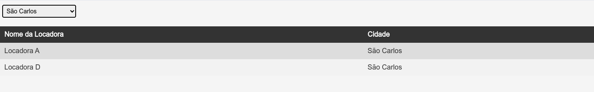

## Página Home
Aqui temos a página home, que é uma página intermediária que aparece sempre após uma autenticação. O curioso nela é que o comportamento de renderização é dinâmico dependendo do papel (role) de autenticação. Se você se autenticar como admin, aparecerá na home um link para acessar a área de administrador. Por outro lado, se você for um user, aparecerá o link correspondente para acessar a área de usuário(cliente).
### Home do Administrador
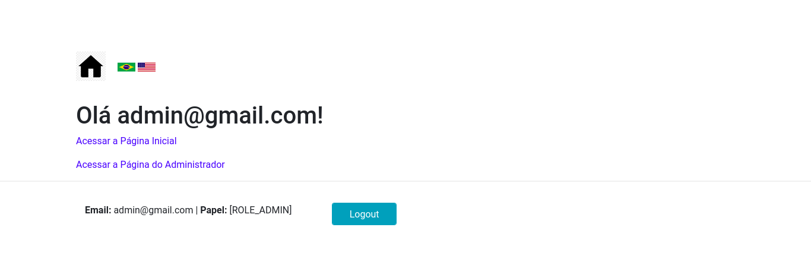
### Home do Cliente
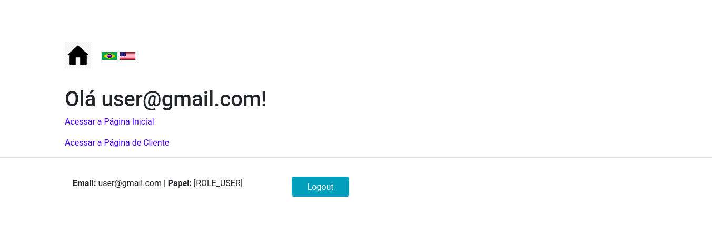
### Home da Locadora
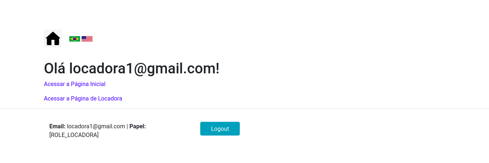
## Página do Administrador
Na página do administrador temos links para as operações de CRUD(Create, Read, Update, Delete) de clientes e locadoras.
foto da pagina do administrador
### Crud Clientes
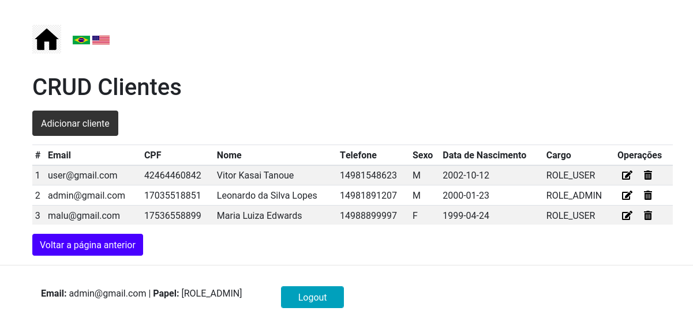
## Crud Locadoras
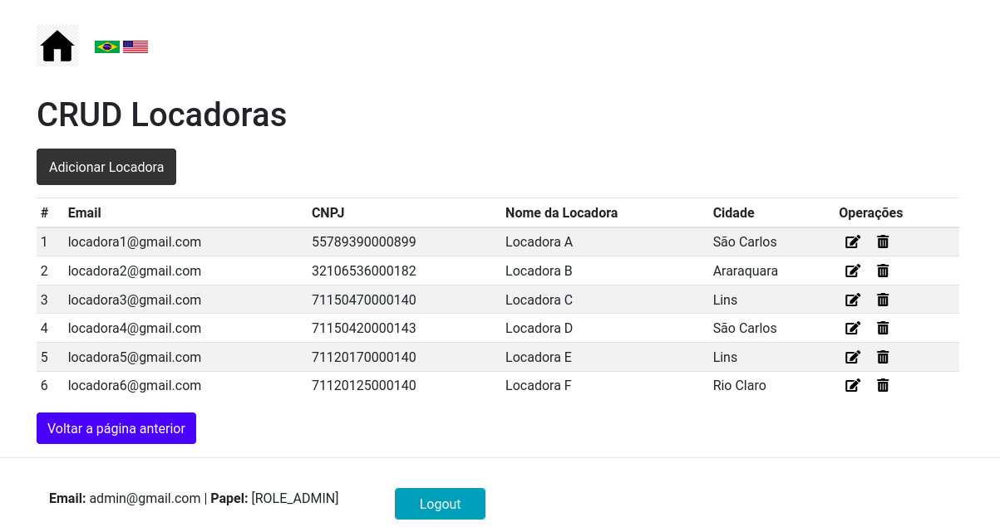

## Página do Cliente(Usuário)
Aqui na página do cliente temos dois links: um para realizar o cadastro de uma locação, e outro para visualizar todas as locações existentes vinculadas ao usuario logado (corrente).

### Cadastro de Locação
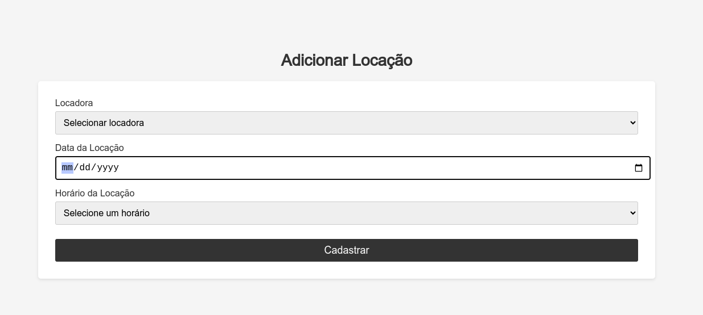
### Lista de Locações do Cliente Logado
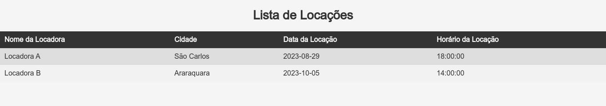

## Página da Locadora 
A locadora também possui uma página no caso de autenticação via email e senha de uma locadora. Nesta página, existe apenas um link referenciando a lista de todas as locações vinculadas à Locadora logada (corrente).
imagem da pagina da locadora
### Lista de Locações da Locadora Logada
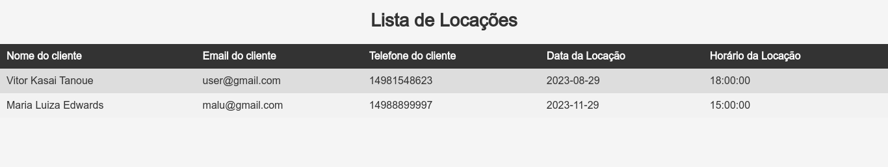

## Refinamentos Finais

### Internacionalização do Sistema
O sistema é internacionalizado através dos templates do Thymeleaf. Isso foi feito pela criação dos arquivos messages_pt.properties e messages_en.properties, passando em application.properties às respectivas basenames. A mudança na internacionalização é feita através do click em duas imagens (bandeiras). O sistema possui somente suporte aos idiomas Inglês e Português-BR.

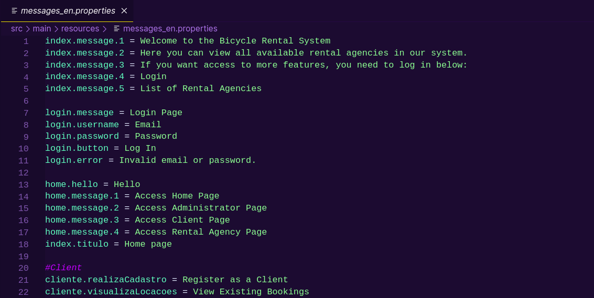
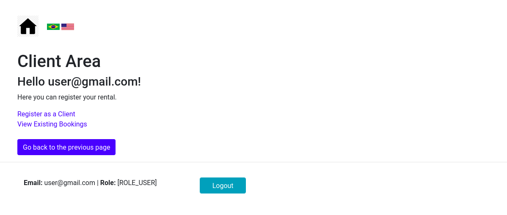

### Erros Amigáveis
A aplicação apresenta mensagens de erro amigáveis no caso de exceções e erros.
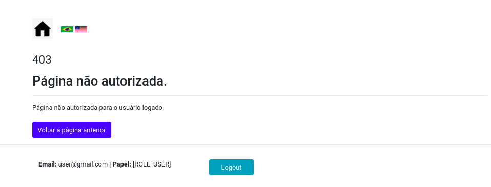

## Colaboradores
- Leonardo da Silva Lopes, aluno BCC UFSCar, github: [github.com/leonardo-lopes-br](https://github.com/leonardo-lopes-br)
- Vitor Kasai Tanoue, aluno BCC UFSCar, github: [github.com/vitorkasai](https://github.com/vitorkasai)
- Maria Luiza Edwards, aluna BCC UFSCar, github: [github.com/maluedwards](https://github.com/maluedwards)
- Karen Ketlyn Barcelos, aluna BCC UFSCar, github: [github.com/42kkkkkaren](https://github.com/42kkkkkaren)

